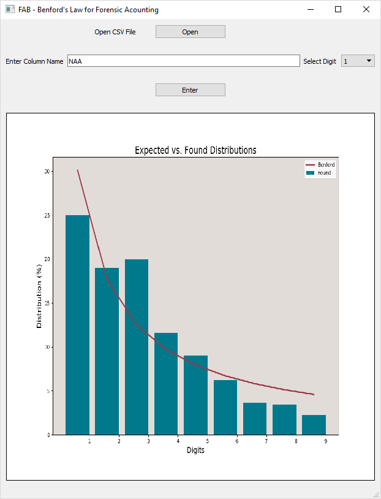

### FAB - Frank Albert Benford

A windows app for the implementation of Benford's Law, build using Python.

+ https://en.wikipedia.org/wiki/Benford's_law

### Benford Module

The python module used is available at the below link.

+ https://github.com/milcent/benford_py

### Source Code

All the python code is available in the Scripts folder.

 
Figure 1. <b>FAB GUI</b>

